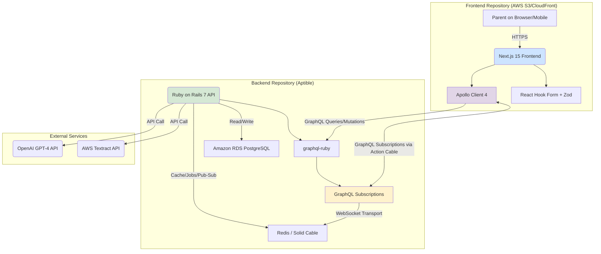

# Product Requirements Document (PRD): Parent Onboarding AI

**Organization:** Daybreak Health
**Project ID:** p4oHJcP0IdbGuVksPpch_1762212723037
**Author:** Manus AI
**Version:** 1.2
**Date:** November 28, 2025
**Last Updated:** November 28, 2025 (Tech stack audit & real-time architecture update)

---

## 1. Executive Summary

The Parent Onboarding AI is a transformative feature for Daybreak Health designed to streamline and enhance the onboarding experience for parents seeking mental health services for their children. This document outlines the product requirements, technical architecture, and implementation strategy for a scalable and secure platform. By leveraging AI for assessment, simplifying insurance data entry, and providing real-time support, the project aims to significantly reduce onboarding friction, decrease drop-off rates, and accelerate the delivery of care to children in need. The architecture is designed as a greenfield system with a decoupled frontend and backend, prioritizing a phased rollout starting with a Minimum Viable Product (MVP).

## 2. Problem Statement

Daybreak Health’s current parent onboarding process presents several significant barriers that lead to high drop-off rates. Parents often feel overwhelmed and confused when trying to articulate their child's mental health needs, find the insurance submission process cumbersome and intimidating, and experience emotional stress throughout the journey. These challenges create a bottleneck that prevents many families from accessing timely care. This project directly addresses these pain points by creating an intuitive, supportive, and efficient AI-driven onboarding flow.

## 3. Goals & Success Metrics

The primary goal is to increase the conversion rate of interested parents into active patients. Success will be measured against the following key performance indicators (KPIs):

| Metric | Target | Priority |
| :--- | :--- | :--- |
| **Increase in Service Requests** | +30% | P0 |
| **Insurance Submission Drop-off** | -50% | P1 |
| **Onboarding Completion Rate** | +40% | P0 |
| **Onboarding Time (Motivated User)** | < 15 minutes | P0 |
| **Patient Longevity (Retention)** | +20% | P2 |
| **Parent Net Promoter Score (NPS)** | 70+ | P0 |

## 4. Target Users & Personas

**Primary User:** Parents or legal guardians of children (ages 10-19) who are seeking mental health services.

- **Needs:** A clear and simple way to understand if Daybreak Health is right for their child, an easy method to handle insurance and administrative tasks, and emotional support and reassurance during a stressful time.
- **Pain Points:** Confusion over their child’s symptoms, frustration with complex insurance forms, and feelings of anxiety and isolation during the onboarding process.

## 5. User Stories

- **As a parent,** I want to assess if Daybreak Health services are suitable for my child so that I can make an informed decision about their mental health care.
- **As a parent,** I want to submit my insurance information easily, perhaps by just taking a picture of my card, so that I can quickly move forward with the onboarding process.
- **As a parent,** I want to receive support and reassurance throughout the onboarding process so that I feel confident in the care my child will receive.

## 6. Functional Requirements

Functional requirements are organized by capability area. Each requirement specifies WHAT the system must do, not HOW it will be implemented. Technical implementation details are defined in the Architecture document.

**Priority Legend:** `[MVP]` = Must-have for launch | `[Growth]` = Post-MVP enhancement | `[Vision]` = Future consideration

---

### 6.1 Assessment & Screening

| ID | Requirement | Priority |
|:---|:------------|:---------|
| FR-001 | The system shall provide a conversational AI interface that guides parents through a mental health screening questionnaire for their child. | [MVP] |
| FR-002 | The assessment shall adapt questions based on previous responses to gather relevant clinical information. | [MVP] |
| FR-003 | The system shall generate a summary of assessment findings to inform therapist matching. | [MVP] |

---

### 6.2 Onboarding & Data Collection

| ID | Requirement | Priority |
|:---|:------------|:---------|
| FR-004 | The system shall collect parent demographic information (name, contact, relationship to child). | [MVP] |
| FR-005 | The system shall collect child demographic information (name, date of birth, pronouns). | [MVP] |
| FR-006 | The system shall collect clinical intake information (primary concerns, relevant history). | [MVP] |
| FR-007 | The system shall persist onboarding progress, allowing parents to resume an incomplete session. | [MVP] |

---

### 6.3 Insurance Management

| ID | Requirement | Priority |
|:---|:------------|:---------|
| FR-008 | The system shall allow parents to manually enter insurance information (carrier, member ID, group number). | [MVP] |
| FR-009 | The system shall allow parents to upload an image of their insurance card for automated data extraction. | [Growth] |
| FR-010 | The system shall provide an upfront cost estimate based on submitted insurance information. | [Growth] |

---

### 6.4 Scheduling

| ID | Requirement | Priority |
|:---|:------------|:---------|
| FR-011 | The system shall suggest therapists based on assessment results, child's needs, and availability. | [MVP] |
| FR-012 | The system shall display available appointment slots for selected therapists. | [MVP] |
| FR-013 | The system shall allow parents to book an appointment and receive confirmation. | [MVP] |

---

### 6.5 Support & Communication

| ID | Requirement | Priority |
|:---|:------------|:---------|
| FR-014 | The system shall provide real-time chat support connecting parents with Daybreak staff during onboarding. | [Growth] |
| FR-015 | The system shall deliver confirmation and reminder notifications via email. | [MVP] |

---

### 6.6 Educational Resources

| ID | Requirement | Priority |
|:---|:------------|:---------|
| FR-016 | The system shall provide a library of educational content (articles, videos) about child mental health. | [Vision] |
| FR-017 | The system shall provide a searchable knowledge base for common questions and symptoms. | [Vision] |

---

**Total: 17 Functional Requirements**
- MVP: 11 requirements
- Growth: 3 requirements
- Vision: 2 requirements
- Support (MVP): 1 requirement

## 7. Non-Functional Requirements

- **Performance:** The system must support up to 1,000 concurrent users with an average API response time of under 500ms and AI interaction response times under 3 seconds.
- **Security:** The platform must be fully compliant with HIPAA. All Protected Health Information (PHI) and Personally Identifiable Information (PII) must be encrypted in transit (TLS 1.2+) and at rest (AES-256).
- **Scalability:** The architecture must be able to scale horizontally to accommodate growth beyond the initial 1,000 concurrent user target.
- **Usability & Accessibility:** The user interface must be intuitive, mobile-first, and compliant with Web Content Accessibility Guidelines (WCAG) 2.1 AA standards.
- **Browser Compatibility:** Modern browsers required due to Tailwind CSS v4 dependencies (`@property`, `color-mix()`). Minimum supported: Chrome 111+ (March 2023), Safari 16.4+ (March 2023), Firefox 128+ (July 2024). IE11 and legacy Edge are not supported.

## 8. System Architecture & Technology Stack

The system will be architected with a **decoupled frontend and backend**, housed in **two separate code repositories**. This approach provides clear separation of concerns, enables independent development and deployment cycles, and aligns with modern best practices for building scalable and maintainable web applications.

### 8.1. High-Level Architecture

The architecture consists of a stateless Next.js frontend application that communicates with a stateful Ruby on Rails backend via a GraphQL API. This separation ensures that the user interface logic is distinct from the business logic and data persistence layer.

### 8.2. Codebase Structure: Separate Repositories

This project will be organized into two distinct Git repositories:

1.  **`parent-onboarding-frontend`**: A Next.js application responsible for all user interface components, views, and client-side logic.
2.  **`parent-onboarding-backend`**: A Ruby on Rails application serving as a pure API backend. It will handle all business logic, data processing, database interactions, and communication with external services.

**Justification for Separate Repositories:**

| Benefit | Description |
| :--- | :--- |
| **Independent Lifecycles** | The frontend and backend can be developed, tested, and deployed independently, increasing team velocity. |
| **Clear Separation of Concerns** | Enforces a clean API boundary (GraphQL) and prevents frontend logic from leaking into the backend, and vice-versa. |
| **Technology Flexibility** | The frontend framework can be updated or replaced without impacting the backend. The same backend API can later serve a native mobile app. |
| **Enhanced Security** | The frontend is a pure client application, while the backend, which holds all sensitive logic and PHI, can be secured independently. |
| **Scalability** | Frontend and backend infrastructure can be scaled independently based on their specific resource needs. |

### 8.3. Technology Stack & Justification

#### Frontend Stack

| Component | Technology | Version | Justification |
| :--- | :--- | :--- | :--- |
| **Framework** | **Next.js** | 15.x | App Router with React Server Components, Turbopack for fast builds, built-in TypeScript support. Deployed as static site to AWS S3/CloudFront. |
| **UI Library** | **React** | 19.x | Latest features including `use` hook, Actions, `useActionState` for forms, and ref as prop. |
| **Language** | **TypeScript** | 5.x | End-to-end type safety from GraphQL schema to components. |
| **GraphQL Client** | **Apollo Client** | 4.x | With `@apollo/client-integration-nextjs` for App Router. Provides caching, Suspense support, and unified API for queries/mutations/subscriptions. |
| **Code Generation** | **GraphQL Code Generator** | Latest | Generates TypeScript types and React hooks from `api_schema.graphql`. Uses `typescript-react-apollo` plugin. |
| **Styling** | **Tailwind CSS** | 4.x | Utility-first CSS with CSS-first configuration. Form state variants (`invalid:`, `focus:`, `disabled:`). Requires modern browsers (Chrome 111+, Safari 16.4+, Firefox 128+). |
| **Form Handling** | **React Hook Form** | 7.x | Performant, uncontrolled form handling with minimal re-renders. |
| **Validation** | **Zod** | 3.x | TypeScript-first schema validation. Integrates with React Hook Form via `@hookform/resolvers/zod`. (v3 for stability per Architecture ADR-004) |

#### Backend Stack

| Component | Technology | Version | Justification |
| :--- | :--- | :--- | :--- |
| **Framework** | **Ruby on Rails** | 7.x | API-only mode. Mature, rapid development with strong conventions. |
| **Database** | **Amazon RDS for PostgreSQL** | - | Managed, HIPAA-compliant with automated backups and failover. |
| **API** | **GraphQL** | - | `graphql-ruby` gem with `GraphQL::Subscriptions::ActionCableSubscriptions` for real-time. |
| **AI/LLM** | **OpenAI GPT-4** | - | Conversational AI with BAA for HIPAA compliance. |
| **Insurance OCR** | **AWS Textract** | - | HIPAA-compliant OCR optimized for document extraction. |
| **Real-time Transport** | **Action Cable** | - | Rails' native WebSocket framework. Serves as transport for GraphQL subscriptions. Can use `solid_cable` (database-backed) to avoid Redis dependency for MVP. |
| **Caching/Jobs** | **Redis** | - | High-performance cache, Sidekiq backend, Action Cable pub/sub (production). |
| **Hosting** | **Aptible** | - | HIPAA-compliant PaaS for backend deployment. |

## 9. Development & Deployment Workflow

-   **Local Development:** Developers will run two local servers: the Rails API (e.g., on `localhost:3001`) and the Next.js app (e.g., on `localhost:3000`). The Next.js app will be configured to proxy API requests to the Rails server.
-   **Version Control:** Both repositories will use Git, with a main branch for production code and feature branches for development.
-   **CI/CD:** Separate CI/CD pipelines will be set up for each repository (e.g., using GitHub Actions). The backend pipeline will run RSpec tests and deploy to Aptible. The frontend pipeline will run Vitest unit tests, Playwright E2E tests, build the static Next.js site, and deploy it to AWS S3.
-   **CORS:** The Rails backend will be configured to accept cross-origin requests only from the deployed frontend domain to ensure security.

## 10. Testing Strategy

A multi-layered testing approach will ensure quality and reliability.

-   **Unit Tests:** RSpec for the Rails backend. Vitest + React Testing Library for the Next.js frontend (faster than Jest with native ESM support).
-   **Integration Tests:** Test the interactions between the frontend, backend, and external APIs (OpenAI, AWS Textract). Use MSW (Mock Service Worker) for API mocking.
-   **End-to-End (E2E) Tests:** Playwright for cross-browser testing and user flow simulation. Preferred over Cypress for better TypeScript support and parallel execution.
-   **Type Safety Tests:** GraphQL Code Generator ensures compile-time validation of all GraphQL operations against the schema.
-   **AI Testing:** A golden dataset of question-answer pairs will be used to validate the chatbot's responses for accuracy, tone, and safety. Regular human review of conversation logs will be required.
-   **Test Data:** The test cases provided by Daybreak Health will be used for manual and automated QA. [1]

## 11. Out of Scope

The following functionalities are explicitly out of scope for this project:

-   Long-term therapy outcome tracking.
-   Direct billing, invoicing, or payment processing within the platform.
-   A native mobile application (the web app will be mobile-responsive).

## 12. References

[1] Daybreak Health Test Cases. [https://drive.google.com/drive/folders/159LB-svTUPmO1bThFvzo6hti6hIYwcG1](https://drive.google.com/drive/folders/159LB-svTUPmO1bThFvzo6hti6hIYwcG1)
