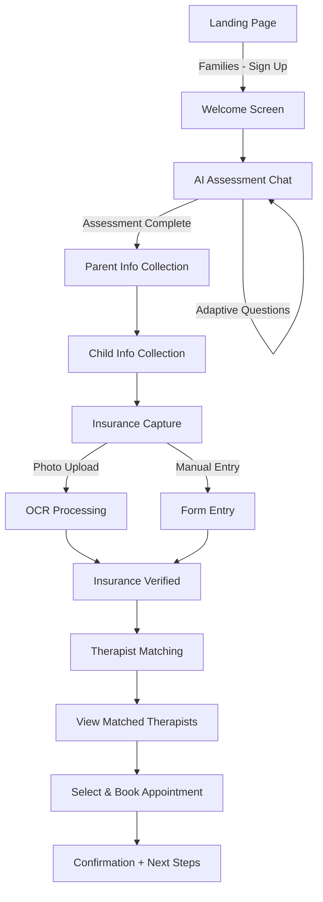

# Parent Onboarding AI - UX Design Specification

_Created on November 28, 2025 by BMad_
_Generated using BMad Method - Create UX Design Workflow v1.0_

---

## Executive Summary

**Project Vision:** A transformative AI-driven onboarding experience for Daybreak Health that guides worried parents through the emotionally charged process of seeking mental health services for their children (ages 10-19).

**Core Mission:** Replace overwhelming clinical forms with supportive, adaptive conversations that meet parents where they are emotionally—turning a bureaucratic process into a bridge to hope.

**Target Users:** Parents and legal guardians navigating the scary, confusing world of child mental health. Picture Sarah at 2am, searching "my teenager won't get out of bed"—exhausted, scared, and needing guidance, not forms.

**Key Pain Points Addressed:**
1. Parents struggle to articulate their child's mental health struggles
2. Insurance forms feel like bureaucratic roadblocks during a crisis moment
3. The process feels cold and clinical when families need warmth and reassurance

**Success Metrics:**
- +30% increase in service requests
- -50% drop-off at insurance submission step
- +40% onboarding completion rate
- <15 minutes for motivated user completion
- NPS of 70+ (parents actively recommend)

**Platform:** Mobile-first responsive web application
**Tech Stack:** Next.js 15, React 19, Apollo Client 4, GraphQL, Tailwind CSS 4
**Critical Constraint:** Full HIPAA compliance required for all PHI/PII handling

---

## 1. Design System Foundation

### 1.1 Design System Choice

**Selected System:** shadcn/ui with Daybreak Brand Customization

**Rationale:**
- **Tailwind CSS v4 native** - aligns perfectly with tech stack requirements
- **Accessible by default** - WCAG AA compliance built-in, critical for healthcare
- **Fully customizable** - can match Daybreak's existing warm brand identity
- **Component-based** - copy-paste architecture allows selective adoption
- **React 19 compatible** - supports latest React features including `use` hook

**Components Provided by shadcn/ui:**
- Button (primary, secondary, outline, ghost variants)
- Input, Textarea, Select, Checkbox, Radio
- Card, Dialog, Sheet, Popover, Tooltip
- Progress, Skeleton, Avatar
- Alert, Toast notifications
- Form components with built-in validation states

**Custom Components Needed:**
- AI Chat Bubble (with typing indicator, avatar, timestamp)
- Insurance Card Scanner/Upload
- Therapist Match Card
- Progress Stepper (for onboarding flow)
- Quick Reply Chips (for chat responses)

---

## 2. Core User Experience

### 2.1 Defining Experience

**The One-Liner:** "It's like texting a supportive friend who happens to be a healthcare expert."

**Core Experience:** AI-guided conversational onboarding that adapts to emotional state

**What Makes This Unique:**
- Conversational, not form-based
- Emotionally intelligent responses
- Photo-first insurance capture
- Transparent therapist matching with rationale

### 2.2 Core Experience Principles

| Principle | Implementation |
|-----------|----------------|
| **Speed** | Under 15 minutes total, no step longer than 2 minutes |
| **Guidance** | High guidance with clear progress indicators; parents shouldn't have to guess what's next |
| **Flexibility** | Quick replies for common answers + free text for those who want to explain |
| **Feedback** | Warm, conversational confirmations; celebrate small wins along the way |

### 2.3 Emotional Design Goals

**Primary Feeling:** Supported and understood (not judged)
**Secondary Feeling:** Hopeful and relieved (help is coming)
**Tertiary Feeling:** In control (clear next steps, can pause anytime)

**Design Implications:**
- Warm color palette (teal + cream, not clinical white)
- Conversational tone in all copy
- Progress visibility at all times
- "Save & Exit" always accessible
- Human support option visible

---

## 3. Visual Foundation

### 3.1 Color System (Daybreak Brand)

**Primary Palette:**

| Color | Hex | Usage |
|-------|-----|-------|
| Daybreak Teal | `#2A9D8F` | Primary actions, headings, links |
| Teal Light | `#3DBCB0` | Hover states, secondary elements |
| Warm Orange | `#E9A23B` | Secondary CTAs, accents, warmth |
| Cream Background | `#FEF7ED` | Page backgrounds |
| Deep Text | `#1A3C34` | Body text, headings |

**Semantic Colors:**

| Purpose | Hex | Usage |
|---------|-----|-------|
| Success | `#10B981` | Confirmation, completion states |
| Warning | `#F59E0B` | Attention needed, info notices |
| Error | `#E85D5D` | Validation errors, critical alerts |
| Info | `#3B82F6` | Informational messages |

**Chat Interface Colors:**

| Element | Color |
|---------|-------|
| AI Message Background | `#F0FDFA` (light teal tint) |
| User Message Background | `#2A9D8F` (primary teal) |
| User Message Text | `#FFFFFF` |

### 3.2 Typography System

**Headline Font:** Fraunces (Variable Serif)
- Used for: Page titles, section headers, emotional emphasis
- Weights: 400, 500, 600, 700
- Character: Warm, approachable, premium

**Body Font:** Inter (Sans-serif)
- Used for: Body text, UI elements, forms
- Weights: 400, 500, 600, 700
- Character: Clean, readable, modern

**Type Scale:**

| Element | Size | Weight | Font |
|---------|------|--------|------|
| Page Title | 2.5rem (40px) | 600 | Fraunces |
| Section Header | 1.5rem (24px) | 600 | Fraunces |
| Card Title | 1.125rem (18px) | 600 | Inter |
| Body Large | 1.125rem (18px) | 400 | Inter |
| Body | 1rem (16px) | 400 | Inter |
| Small | 0.875rem (14px) | 400 | Inter |
| Caption | 0.75rem (12px) | 400 | Inter |

### 3.3 Spacing System

**Base Unit:** 4px

| Token | Value | Usage |
|-------|-------|-------|
| xs | 4px | Tight spacing, icon gaps |
| sm | 8px | Compact elements |
| md | 16px | Standard padding |
| lg | 24px | Section spacing |
| xl | 32px | Major sections |
| 2xl | 48px | Page sections |
| 3xl | 64px | Hero areas |

### 3.4 Border Radius

| Token | Value | Usage |
|-------|-------|-------|
| sm | 8px | Inputs, small cards |
| md | 12px | Buttons, tags |
| lg | 16px | Cards, modals |
| xl | 24px | Large cards, chat bubbles |
| full | 9999px | Pills, avatars, circular buttons |

**Daybreak Style:** Generous radii throughout (rounded, friendly feel)

**Interactive Visualizations:**
- Color Theme Explorer: [ux-color-themes.html](./ux-color-themes.html)

---

## 4. Design Direction

### 4.1 Chosen Design Approach

**Direction:** Adaptive Hybrid - Immersive Chat + Focused Cards

**Layout Strategy:**
- **Primary Mode:** Full-screen conversational chat (ChatGPT/iMessage style)
- **Structured Questions:** Single-card wizard (Typeform style) for clinical assessments
- **Insurance Step:** Photo-first upload with OCR (mobile banking style)
- **Results:** Card-based therapist matching with clear rationale

**Visual Characteristics:**

| Attribute | Choice | Rationale |
|-----------|--------|-----------|
| Layout | Centered, single-column | Reduces overwhelm, mobile-native |
| Density | Spacious | Breathing room for emotional content |
| Navigation | Linear with progress bar | Clear path, no cognitive load |
| Hierarchy | Warm colors for primary actions | Teal = trust, Orange = warmth |
| Depth | Subtle shadows, no harsh borders | Soft, approachable feel |

**Key Screens:**
1. Welcome/Start
2. AI Assessment Chat
3. Insurance Capture
4. Therapist Matching Results
5. Appointment Booking
6. Confirmation

**Interactive Mockups:**
- Design Direction Showcase: [ux-design-directions.html](./ux-design-directions.html)

---

## 5. User Journey Flows

### 5.1 Primary Journey: Parent Onboarding

### 5.2 Journey: AI Assessment Chat

**Goal:** Understand child's mental health needs through supportive conversation

**Flow Approach:** Conversational with quick replies

**Steps:**
1. **Entry:** Warm greeting, set expectations (~5 min)
2. **Opening Question:** "Tell me what's been going on with [child name]"
3. **Adaptive Follow-ups:** Based on keywords and sentiment
4. **Structured Questions:** Sleep, appetite, school, social (card format)
5. **Summary:** "Here's what I'm hearing..." for validation
6. **Transition:** Smooth handoff to data collection

**Error Handling:**
- If user seems distressed: Offer human support option
- If answers are too brief: Gentle prompts for more detail
- If session abandoned: Save progress, email reminder

### 5.3 Journey: Insurance Submission

**Goal:** Capture insurance info with minimal friction

**Flow Approach:** Photo-first with fallback to manual

**Steps:**
1. **Entry:** "Let's handle insurance - this is the quick part!"
2. **Primary CTA:** "Snap a photo of your card" (camera/upload)
3. **Processing:** "Reading your card..." with progress indicator
4. **Verification:** Show extracted data, allow corrections
5. **Confirmation:** "All set! Your insurance is verified."

**Error Handling:**
- If OCR fails: "No worries, let's enter it manually"
- If insurance not accepted: Offer self-pay options with empathy
- If user stuck: Live chat support prominent

### 5.4 Journey: Therapist Matching

**Goal:** Build confidence in therapist selection

**Flow Approach:** Transparent matching with rationale

**Steps:**
1. **Processing:** "Finding the best matches for [child]..."
2. **Results:** 2-3 matched therapists with "why" explanation
3. **Profiles:** Specialty, experience, availability, approach
4. **Selection:** "Book Now" or "Learn More"
5. **Scheduling:** Available slots, timezone handling
6. **Confirmation:** Celebration moment, next steps clear

---

## 6. Component Library

### 6.1 Component Strategy

**From shadcn/ui (styled to Daybreak brand):**
- Button, Input, Textarea, Select
- Card, Dialog, Sheet
- Progress, Avatar, Badge
- Alert, Toast
- Skeleton (loading states)

### 6.2 Custom Components

#### AI Chat Bubble

**Purpose:** Display AI and user messages in conversation

**Anatomy:**
- Avatar (AI: Daybreak mountain icon, User: initials or blank)
- Message content (supports markdown, links)
- Timestamp
- Typing indicator (AI only)

**Variants:**
- AI Message (light teal background, left-aligned)
- User Message (teal background, white text, right-aligned)
- System Message (centered, muted)

**States:**
- Default, Loading (typing dots), Error

#### Quick Reply Chips

**Purpose:** Provide tap-to-respond options in chat

**Anatomy:**
- Text label
- Optional icon

**States:**
- Default (outline), Hover (filled), Selected (teal fill), Disabled

#### Insurance Card Scanner

**Purpose:** Camera capture and upload for insurance cards

**Anatomy:**
- Camera viewfinder / drop zone
- Capture button
- Preview with crop
- OCR status indicator
- Manual entry fallback link

**States:**
- Ready, Capturing, Processing, Success, Error

#### Therapist Match Card

**Purpose:** Display matched therapist with booking CTA

**Anatomy:**
- Photo/avatar
- Name, credentials
- Specialty tags
- Match reason badge
- Availability preview
- Action buttons (Book Now, View Profile)

**Variants:**
- Best Match (highlighted border)
- Standard Match

#### Progress Stepper

**Purpose:** Show onboarding progress

**Anatomy:**
- Step indicators (numbered circles)
- Step labels
- Connecting lines
- Current step highlight

**Variants:**
- Horizontal (desktop)
- Minimal (mobile - dots only)

---

## 7. UX Pattern Decisions

### 7.1 Consistency Rules

#### Button Hierarchy

| Level | Style | Usage |
|-------|-------|-------|
| Primary | Solid teal, pill shape | Main actions (Continue, Book Now) |
| Secondary | Solid orange, pill shape | Alternative CTAs (Schools Demo) |
| Tertiary | Outline teal | Secondary actions (Learn More) |
| Ghost | Text only, teal | Minimal actions (Skip, Back) |
| Destructive | Solid red | Cancel, Remove (rare) |

#### Feedback Patterns

| Type | Pattern | Duration |
|------|---------|----------|
| Success | Toast (bottom) + inline | 4 seconds |
| Error | Inline below field | Persistent until fixed |
| Warning | Alert banner (top of section) | Dismissible |
| Loading | Skeleton OR spinner with text | Until complete |
| Progress | Progress bar + percentage | Real-time |

#### Form Patterns

| Element | Pattern |
|---------|---------|
| Labels | Above input, always visible |
| Required indicator | Asterisk (*) after label |
| Validation timing | On blur + on submit |
| Error display | Inline below field, red text |
| Help text | Below input, muted color |
| Placeholder | Light gray, example text |

#### Modal Patterns

| Attribute | Pattern |
|-----------|---------|
| Size | Small (400px), Medium (600px), Full (mobile) |
| Dismiss | Click outside, X button, Escape key |
| Focus | Auto-focus first interactive element |
| Scroll | Modal scrolls, not page |

#### Empty States

| Context | Pattern |
|---------|---------|
| First use | Welcoming message + primary CTA |
| No results | Helpful message + alternative action |
| Error state | Explanation + retry option |

#### Confirmation Patterns

| Action | Confirmation |
|--------|--------------|
| Delete | Modal with explicit "Delete" button |
| Leave unsaved | Modal warning + Save option |
| Irreversible | Type confirmation required |
| Standard submit | Inline success feedback |

---

## 8. Responsive Design & Accessibility

### 8.1 Responsive Strategy

**Breakpoints:**

| Name | Width | Layout |
|------|-------|--------|
| Mobile | < 640px | Single column, bottom nav |
| Tablet | 640-1024px | Single column, larger touch targets |
| Desktop | > 1024px | Centered content (max-width: 640px for chat) |

**Adaptation Patterns:**

| Element | Mobile | Desktop |
|---------|--------|---------|
| Navigation | Minimal header, save in menu | Full header with progress |
| Chat bubbles | Full width - 16px | Max 75% width |
| Quick replies | Horizontal scroll | Wrap |
| Cards | Full width | Max 600px centered |
| Modals | Full screen (sheet) | Centered dialog |
| Input | Large (48px height) | Standard (40px) |

### 8.2 Accessibility Requirements

**Compliance Target:** WCAG 2.1 Level AA

**Key Requirements:**

| Requirement | Implementation |
|-------------|----------------|
| Color contrast | 4.5:1 for body text, 3:1 for large text |
| Keyboard navigation | All interactive elements focusable |
| Focus indicators | Visible focus ring (2px teal outline) |
| Screen reader | ARIA labels on all interactive elements |
| Alt text | Descriptive text for images |
| Form labels | Proper label associations |
| Error messages | Clear, specific, associated with fields |
| Touch targets | Minimum 44x44px |

**Testing Strategy:**
- Automated: Lighthouse, axe DevTools
- Manual: Keyboard-only navigation testing
- Screen reader: VoiceOver (Mac), NVDA (Windows)

**HIPAA Considerations:**
- No PHI in URLs or browser history
- Session timeout warnings
- Secure form submission indicators
- Privacy mode option (hide sensitive info on screen)

---

## 9. Implementation Guidance

### 9.1 Development Priorities

**Phase 1 (MVP):**
1. Core chat interface with AI integration
2. Basic assessment flow
3. Manual insurance entry
4. Simple therapist display
5. Basic appointment booking

**Phase 2 (Growth):**
1. Insurance card OCR
2. Advanced therapist matching UI
3. Real-time chat support
4. Progress persistence
5. Email notifications

### 9.2 Component Development Order

1. Design tokens (colors, typography, spacing)
2. Base components (Button, Input, Card)
3. Chat components (Bubble, Quick Reply)
4. Form components (Insurance, Demographics)
5. Result components (Therapist Card, Confirmation)

---

## Appendix

### Related Documents

- Product Requirements: `docs/prd.md`
- Architecture: (pending)

### Core Interactive Deliverables

This UX Design Specification was created through visual collaboration:

- **Color Theme Visualizer**: [ux-color-themes.html](./ux-color-themes.html)
  - Daybreak brand colors with semantic mappings
  - Live UI component examples
  - CSS variables for Tailwind v4

- **Design Direction Mockups**: [ux-design-directions.html](./ux-design-directions.html)
  - 6 complete design approaches
  - Full-screen mockups of key screens
  - Mobile-native chat experience
  - Insurance capture flow
  - Therapist matching UI

### Inspiration Sources

- [Headspace](https://www.headspace.com) - Emotion-driven design, calming UX
- [Oscar Health](https://www.hioscar.com) - Friendly insurance UX
- [ChatGPT](https://chat.openai.com) - Conversational AI interface patterns

### Version History

| Date | Version | Changes | Author |
|------|---------|---------|--------|
| November 28, 2025 | 1.0 | Initial UX Design Specification | BMad |

---

_This UX Design Specification was created through collaborative design facilitation using the BMad Method. All decisions were made with user context and are documented with rationale._
