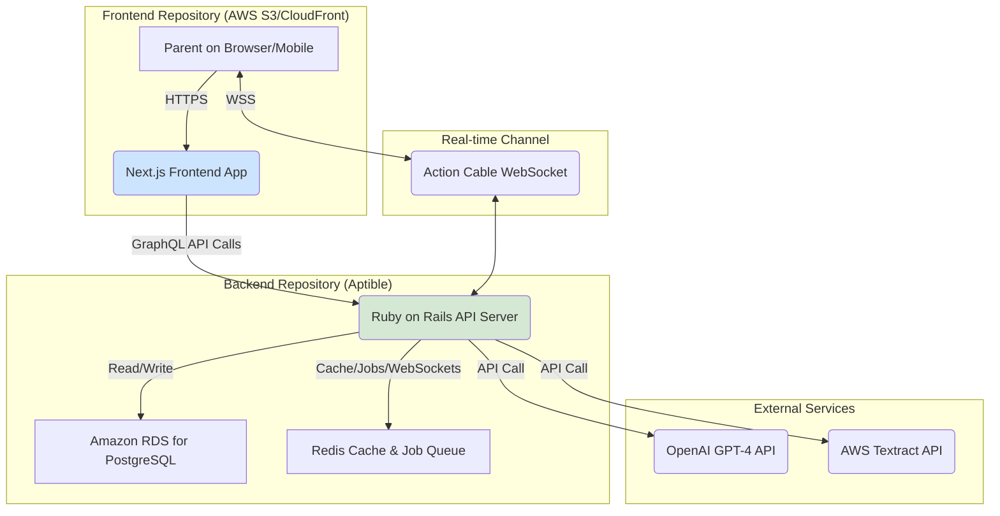

# Product Requirements Document (PRD): Parent Onboarding AI

**Organization:** Daybreak Health
**Project ID:** p4oHJcP0IdbGuVksPpch_1762212723037
**Author:** Manus AI
**Version:** 1.1
**Date:** November 28, 2025

---

## 1. Executive Summary

The Parent Onboarding AI is a transformative feature for Daybreak Health designed to streamline and enhance the onboarding experience for parents seeking mental health services for their children. This document outlines the product requirements, technical architecture, and implementation strategy for a scalable and secure platform. By leveraging AI for assessment, simplifying insurance data entry, and providing real-time support, the project aims to significantly reduce onboarding friction, decrease drop-off rates, and accelerate the delivery of care to children in need. The architecture is designed as a greenfield system with a decoupled frontend and backend, prioritizing a phased rollout starting with a Minimum Viable Product (MVP).

## 2. Problem Statement

Daybreak Health’s current parent onboarding process presents several significant barriers that lead to high drop-off rates. Parents often feel overwhelmed and confused when trying to articulate their child's mental health needs, find the insurance submission process cumbersome and intimidating, and experience emotional stress throughout the journey. These challenges create a bottleneck that prevents many families from accessing timely care. This project directly addresses these pain points by creating an intuitive, supportive, and efficient AI-driven onboarding flow.

## 3. Goals & Success Metrics

The primary goal is to increase the conversion rate of interested parents into active patients. Success will be measured against the following key performance indicators (KPIs):

| Metric | Target | Priority |
| :--- | :--- | :--- |
| **Increase in Service Requests** | +30% | P0 |
| **Insurance Submission Drop-off** | -50% | P1 |
| **Onboarding Completion Rate** | +40% | P0 |
| **Onboarding Time (Motivated User)** | < 15 minutes | P0 |
| **Patient Longevity (Retention)** | +20% | P2 |
| **Parent Net Promoter Score (NPS)** | 70+ | P0 |

## 4. Target Users & Personas

**Primary User:** Parents or legal guardians of children (ages 10-19) who are seeking mental health services.

- **Needs:** A clear and simple way to understand if Daybreak Health is right for their child, an easy method to handle insurance and administrative tasks, and emotional support and reassurance during a stressful time.
- **Pain Points:** Confusion over their child’s symptoms, frustration with complex insurance forms, and feelings of anxiety and isolation during the onboarding process.

## 5. User Stories

- **As a parent,** I want to assess if Daybreak Health services are suitable for my child so that I can make an informed decision about their mental health care.
- **As a parent,** I want to submit my insurance information easily, perhaps by just taking a picture of my card, so that I can quickly move forward with the onboarding process.
- **As a parent,** I want to receive support and reassurance throughout the onboarding process so that I feel confident in the care my child will receive.

## 6. Functional Requirements

The project will be implemented in phases, with a clear distinction between the initial MVP and subsequent enhancements.

### P0: Must-Have (MVP Scope)

- **AI-Powered Assessment Module:** An LLM-powered chatbot (using OpenAI GPT-4) that guides parents through a conversational mental health screener.
- **Streamlined Onboarding Flow:** A multi-step web interface for collecting demographic, clinical intake, and insurance information (manual entry for MVP).
- **AI-Assisted Scheduling Module:** A system that suggests best-fit therapists and appointment slots.

### P1: Should-Have (Post-MVP)

- **Image-to-Text Insurance Submission:** A feature allowing parents to upload a picture of their insurance card for automatic data extraction (via AWS Textract).
- **Cost Estimation Tool:** An automated tool that provides an upfront, good-faith estimate of costs.
- **Real-time Support Interface:** A live chat option (using Action Cable) for parents to connect with Daybreak’s support team.

### P2: Nice-to-Have (Future Enhancements)

- **Emotional Support Content:** A library of curated articles, videos, and resources.
- **Self-Help Resource Center:** A knowledge base for parents to learn more about common mental health symptoms.

## 7. Non-Functional Requirements

- **Performance:** The system must support up to 1,000 concurrent users with an average API response time of under 500ms and AI interaction response times under 3 seconds.
- **Security:** The platform must be fully compliant with HIPAA. All Protected Health Information (PHI) and Personally Identifiable Information (PII) must be encrypted in transit (TLS 1.2+) and at rest (AES-256).
- **Scalability:** The architecture must be able to scale horizontally to accommodate growth beyond the initial 1,000 concurrent user target.
- **Usability & Accessibility:** The user interface must be intuitive, mobile-first, and compliant with Web Content Accessibility Guidelines (WCAG) 2.1 AA standards.

## 8. System Architecture & Technology Stack

The system will be architected with a **decoupled frontend and backend**, housed in **two separate code repositories**. This approach provides clear separation of concerns, enables independent development and deployment cycles, and aligns with modern best practices for building scalable and maintainable web applications.

### 8.1. High-Level Architecture

The architecture consists of a stateless Next.js frontend application that communicates with a stateful Ruby on Rails backend via a GraphQL API. This separation ensures that the user interface logic is distinct from the business logic and data persistence layer.

### 8.2. Codebase Structure: Separate Repositories

This project will be organized into two distinct Git repositories:

1.  **`parent-onboarding-frontend`**: A Next.js application responsible for all user interface components, views, and client-side logic.
2.  **`parent-onboarding-backend`**: A Ruby on Rails application serving as a pure API backend. It will handle all business logic, data processing, database interactions, and communication with external services.

**Justification for Separate Repositories:**

| Benefit | Description |
| :--- | :--- |
| **Independent Lifecycles** | The frontend and backend can be developed, tested, and deployed independently, increasing team velocity. |
| **Clear Separation of Concerns** | Enforces a clean API boundary (GraphQL) and prevents frontend logic from leaking into the backend, and vice-versa. |
| **Technology Flexibility** | The frontend framework can be updated or replaced without impacting the backend. The same backend API can later serve a native mobile app. |
| **Enhanced Security** | The frontend is a pure client application, while the backend, which holds all sensitive logic and PHI, can be secured independently. |
| **Scalability** | Frontend and backend infrastructure can be scaled independently based on their specific resource needs. |

### 8.3. Technology Stack & Justification

| Component | Technology | Justification |
| :--- | :--- | :--- |
| **Frontend** | **Next.js** | A modern, performant, and SEO-friendly React framework. Will be deployed as a static site to AWS S3 and distributed via CloudFront for global low latency. |
| **Backend** | **Ruby on Rails 7** | A robust and mature framework that enables rapid development. It will be configured in API-only mode to serve the GraphQL endpoint. |
| **Database** | **Amazon RDS for PostgreSQL** | A managed, HIPAA-compliant database service that automates backups, patching, and failover. Chosen for its reliability and data integrity. |
| **API** | **GraphQL** | Allows the frontend to request exactly the data it needs, reducing over-fetching and improving performance, especially on mobile networks. The `graphql-ruby` gem will be used. |
| **AI/LLM** | **OpenAI GPT-4** | Provides state-of-the-art conversational AI. Using the official API with a Business Associate Agreement (BAA) ensures HIPAA compliance. |
| **Insurance OCR** | **AWS Textract** | A managed, HIPAA-compliant OCR service optimized for extracting data from documents like insurance cards. |
| **Real-time Chat** | **Action Cable** | Rails' native WebSocket framework. It is sufficient for the MVP's real-time support chat feature and avoids the cost of a third-party service. |
| **Caching/Jobs** | **Redis** | Used as a high-performance cache, a backend for Sidekiq for asynchronous jobs, and as the pub/sub mechanism for Action Cable. |
| **Hosting** | **Aptible (Backend), AWS S3 (Frontend)** | The backend will be deployed on the user's preferred HIPAA-compliant Aptible platform. The frontend will be deployed to AWS S3/CloudFront for optimal performance and scalability. |

## 9. Development & Deployment Workflow

-   **Local Development:** Developers will run two local servers: the Rails API (e.g., on `localhost:3001`) and the Next.js app (e.g., on `localhost:3000`). The Next.js app will be configured to proxy API requests to the Rails server.
-   **Version Control:** Both repositories will use Git, with a main branch for production code and feature branches for development.
-   **CI/CD:** Separate CI/CD pipelines will be set up for each repository (e.g., using GitHub Actions). The backend pipeline will run RSpec tests and deploy to Aptible. The frontend pipeline will run Jest tests, build the static Next.js site, and deploy it to AWS S3.
-   **CORS:** The Rails backend will be configured to accept cross-origin requests only from the deployed frontend domain to ensure security.

## 10. Testing Strategy

A multi-layered testing approach will ensure quality and reliability.

-   **Unit Tests:** RSpec for the Rails backend and Jest/React Testing Library for the Next.js frontend.
-   **Integration Tests:** Test the interactions between the frontend, backend, and external APIs (OpenAI, AWS Textract).
-   **End-to-End (E2E) Tests:** Cypress to simulate user flows through the entire application.
-   **AI Testing:** A golden dataset of question-answer pairs will be used to validate the chatbot's responses for accuracy, tone, and safety. Regular human review of conversation logs will be required.
-   **Test Data:** The test cases provided by Daybreak Health will be used for manual and automated QA. [1]

## 11. Out of Scope

The following functionalities are explicitly out of scope for this project:

-   Long-term therapy outcome tracking.
-   Direct billing, invoicing, or payment processing within the platform.
-   A native mobile application (the web app will be mobile-responsive).

## 12. References

[1] Daybreak Health Test Cases. [https://drive.google.com/drive/folders/159LB-svTUPmO1bThFvzo6hti6hIYwcG1](https://drive.google.com/drive/folders/159LB-svTUPmO1bThFvzo6hti6hIYwcG1)
